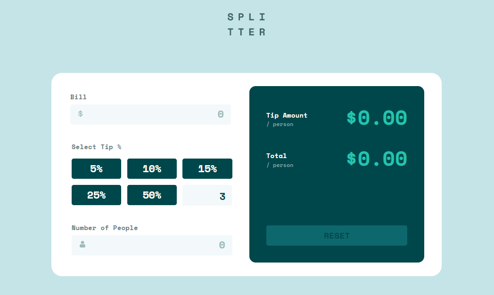

# Tittle - Tip calculator app

### The challenge

Users should be able to:

- View the optimal layout for the app depending on their device's screen size
- See hover states for all interactive elements on the page
- Calculate the correct tip and total cost of the bill per person

### Screenshot

### Links

- Solution URL: https://github.com/giorgisilagadze/tip-calculator;
- Live Site URL: https://tip-calculator-lime-phi.vercel.app/

### Built with

- Semantic HTML5 markup
- CSS custom properties
- Flexbox
- Javascript

### What I learned

I've learned how to use DOM manipulations.